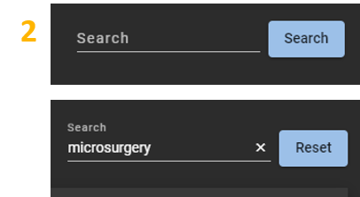

{::options parse_block_html="true" /}

# Navigating the Healthcare Policy Exchange Website

  

    Click for Detals
  

   
## Main Page
  

   

  

    1 Top Navigation Bar
  

   
  
Icons    |  
:-------------------------:|-------------------------
{: style="float: left"}  |  **Main Search11:** Return to the search landing page. Previous search results will display if applicable     **Toggle Theme:** Toggle the site background between Dark (default) and Light (traditional) themes     **Help Page:** I think you figured this one out, since you are here!        

Light Theme            |  Dark Theme
:-------------------------:|:-------------------------:
 | 

 

  

    2 Search Bar
  

   

{: style="float: left"}  - Enter the search string into the search bar and click "Search."      - Click "Reset" to clear search results OR simply type a new search into the search bar.
