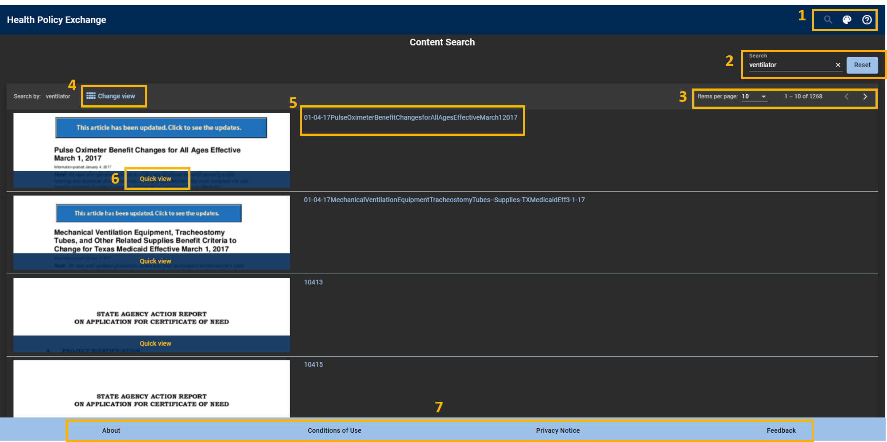

{::options parse_block_html="true" /}

# Navigating the Healthcare Policy Exchange Website

  

    Click for Detals
  

   
## Main Page
{: style="float: left"} 

   

Top Navigation Bar             |  
:-------------------------:|-------------------------
  |  **Main Search:** Return to the search landing page. Previous search results will display if applicable     **Toggle Theme:** Toggle the site background between Dark (default) and Light (traditional) themes     **Help Page:** I think you figured this one out, since you are here!        

Light Theme            |  Dark Theme
:-------------------------:|:-------------------------:
 | 
